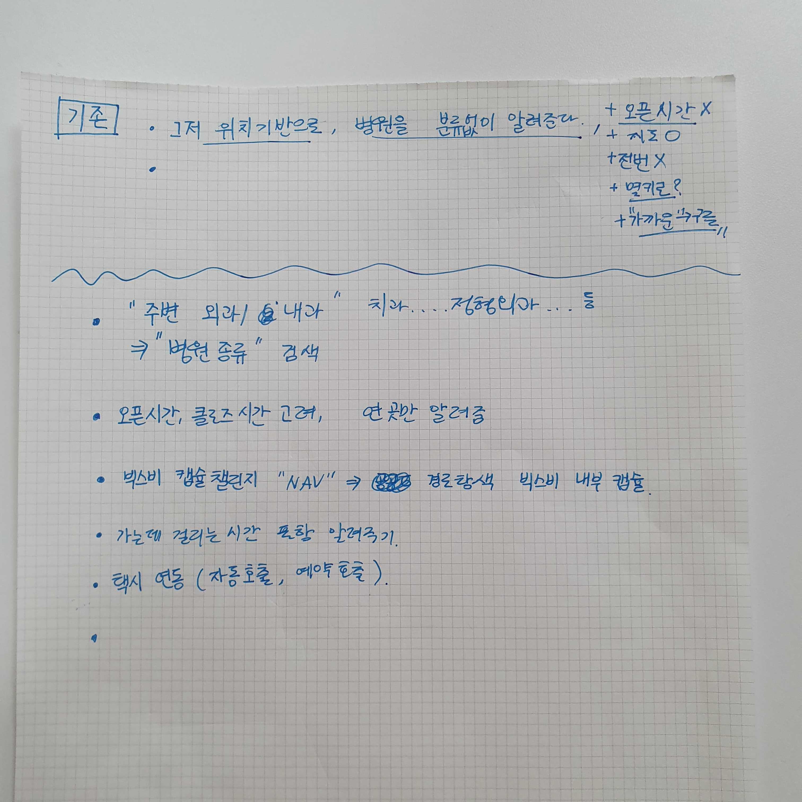
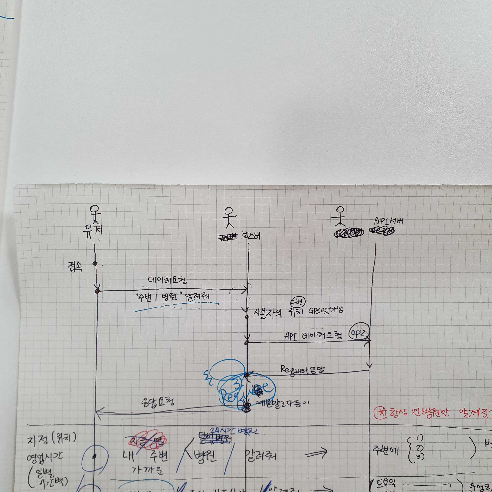
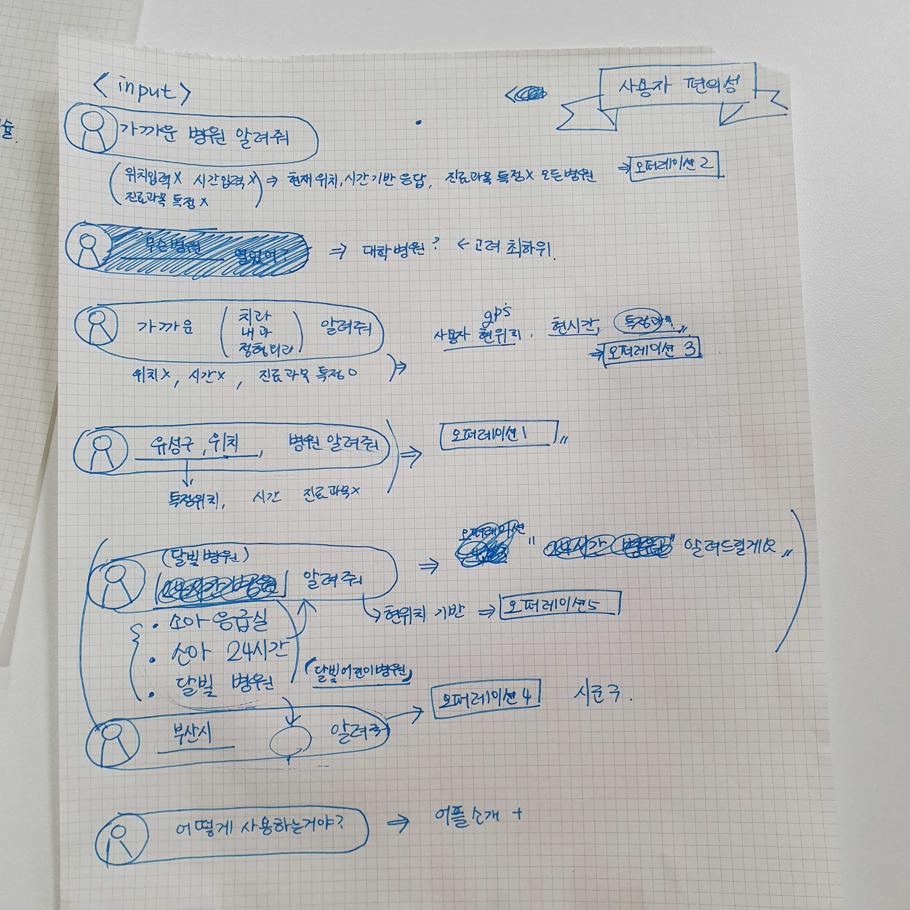
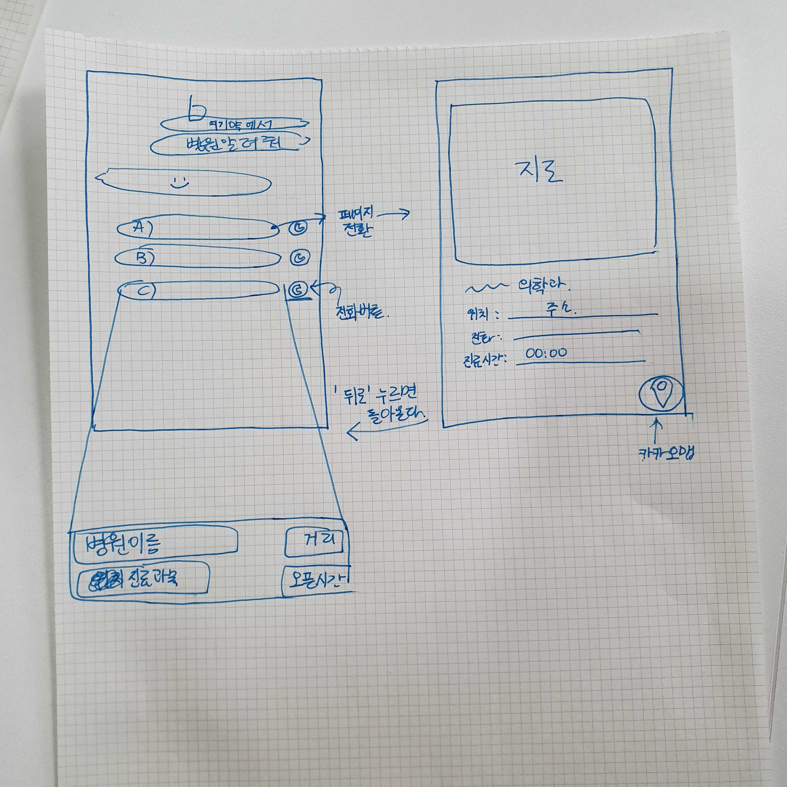

# API 를 활용한 빅스비 캡슐 / 앱 제작

> 공공 API 데이터(병원/약국 정보)를 활용하여 빅스비 캡슐과 안드로이드 어플리케이션 제작을 목표로 한다. 
>
> 어디약(가제)


## 1. 프로젝트 개요

본 프로젝트에서는 빅스비 캡슐 제작을 목표로 발화 인식 및 캡슐 구조 등의 개념을 익히고 활용하여 주어진 위치정보 기반의 병원, 약국 정보들을 가공, 출력합니다.


주어진 API 정보에 따라 데이터 모델링과의 프로토콜을 확립하고, 발화의 intent를 정해 빅스비가 학습할 수 있도록 합니다. UI 구성을 통해 출력 데이터를 표시 및 카카오 네비 API를 사용, 연결할 수 있도록 합니다.


추가적으로, 현재 위치를 기반으로 한 병원/약국 정보를 제공하는 앱 제작을 위해 kotlin의 사용법을 익히고 활용하여 어플리케이션 제작을 목표로 합니다.


## 2. 프로젝트 목표

1. 공공 데이터 API 를 활용하여 현재 위치 기반의 병원/약국 정보 가공하기
   1. 현재 위치 정보 확인하기
   2. 위치 정보 위도, 경도로 변환한 후 병원/약국 정보 가져오기
   3. 업무 시간 및 전화번호 정보 가공
2. 빅스비 plan 그래프 및 plan 수행
   1. 발화 학습
   2. API 제공을 위한 프로토콜 확립
3. 빅스비 UI 구현
4. 카카오네비 API를 활용, 병원 위치까지 경로 가져오기
5. kotlin 기반 어플리케이션제작


## 3. 사전 학습

1. 기술 스택 정리
   + [bixby developer center](<https://bixbydevelopers.com/>)
   + [오픈 API 활용](<http://www.khoa.go.kr/oceanmap/apiguide/html/chapter01.html>)
   + [kotlin]([https://kotlinlang.org](https://kotlinlang.org/))


## 4. 업무 분담

+ API 데이터 요청 및 가공 처리
  + 박상호, 서효정
+ 데이터 input 모델링
  + 한단비
+ 빅스비 plan 및 UI 구현
  + 박성민, 박성주, 이민지


## 5. 회의 구상 내용










## Develop Report

| 발화                          | baby            | dgName          | locality        | locationName      |
| ----------------------------- | --------------- | --------------- | --------------- | ----------------- |
| 가까운 병원 알려줘            | ```undefined``` | 병원            | true            | ```undefined```   |
| 가까운 내과 알려줘            | ```undefined``` | 내과            | true            | ```undefined```   |
| 가까운 달빛병원 알려줘        | true            | ```undefined``` | true            | ```undefined```   |
| 대전광역시 유성구 병원 알려줘 | ```undefined``` | 병원            | ```undefined``` | 대전광역시 유성구 |


### 문제가 되는 발화

| 발화                          | baby            | dgName | locality        | locationName      |
| ----------------------------- | --------------- | ------ | --------------- | ----------------- |
| 대전광역시 유성규 내과 알려줘 | ```undefined``` | 내과   | ```undefined``` | 대전광역시 유성구 |

> flag = 4 를 만들어서 분기처리를 해주면 될듯함
>
> > 추후 업데이트 예정


| 발화                    | baby            | dgName      | locality | locationName    |
| ----------------------- | --------------- | ----------- | -------- | --------------- |
| 가까운 내과 병원 알려줘 | ```undefined``` | 내과 / 병원 | true     | ```undefined``` |

> dgName이 두개가 들어와서, 빅스비 자체에서 dgName을 하나만 넣기 위해 분기처리가됨.
> 이는 스크립트에서 처리할 수 있는 문제가 아님
>
> > 의도한 바는 맞음


| 발화                   | baby            | dgName | locality        | locationName |
| ---------------------- | --------------- | ------ | --------------- | ------------ |
| 대전광역시 약국 알려줘 | ```undefined``` | 약국   | ```undefined``` | 대전광역시   |

> flag=5를 만들어서 분기처리를 해주면 될듯함
>
> > 추후 업데이트 예정