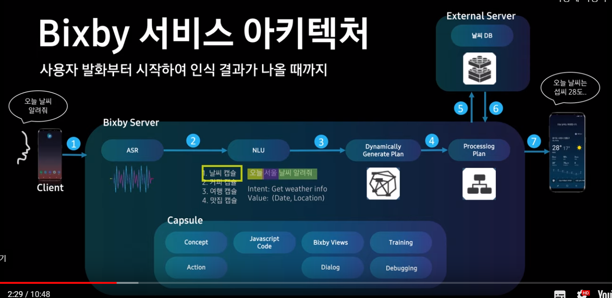

# 빅스비 서비스

### 빅스비 파일 구조

+ models : 발화를 분석하는 역할을 한다. 필요한 intent에 따라 value값을 분석하고, code로 보내줘야 할 값을 뽑는다.
  + A 감독 영화 찾아줘 => A감독
+ code : models에서 넘어온 value를 가지고 수행해야 할 역할을 수행한다.
  + A 감독의 영화를 찾아 결과를 리턴
+ resources : code에서 리턴한 결과를 예쁘게 보여주는 역할을 한다.

### 서비스 아키텍처

Client - Server

+ ASR : 발화를 문자로 바꾸는 역할
+ NLU : 문장의 의미를 이해하는 역할
+ 우리가 해야할 일 == 캡슐 제작 == 캡슐만 잘 만들면 잘 돌아간다.

+ NLU
  + 들어온 문장이 어느 캡슐로 갈지 정한다. 
  + 의도(intent) 파악
  + 정보(value) 추출
+ plan
  + 캡슐 코드 기반으로 정보 수집
  + 외부 서버와의 연결도 여기서 수행한다.